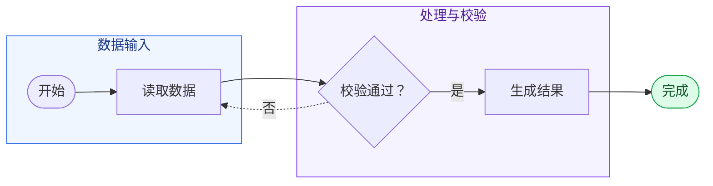
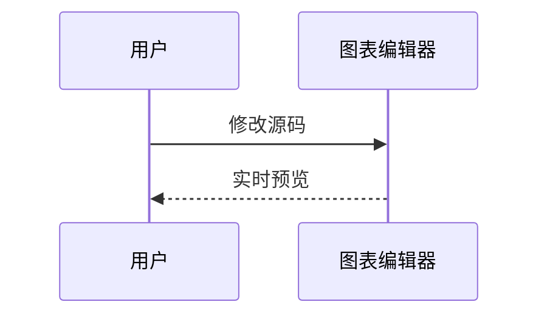

# Mermaid 图表编辑示例

在文档工作台中打开本文件，悬停在图表上，点击铅笔按钮进入可视化编辑器。
可以双击节点修改文字，拖动节点间连线，在右侧调整分组和样式，再点击“应用”写回 Markdown。

```mermaid
flowchart LR
    %% 图形编辑会保留此注释和下面的样式定义
    subgraph Input["数据输入"]
        A(["开始"]) --> B["读取数据"]
    end
    subgraph Process["处理与校验"]
        C{"校验通过？"}
        D["生成结果"]
    end
    B --> C
    C -->|"是"| D
    C -.->|"否"| B
    D --> E(["完成"])
    classDef success fill:#dcfce7,stroke:#16a34a,color:#14532d
    class E success
    style Input fill:#eff6ff,stroke:#2563eb,color:#1e3a8a
    style Process fill:#f5f3ff,stroke:#7c3aed,color:#4c1d95
```

应用后仍是标准 Mermaid 代码块，可继续修改源码，也可通过文档撤销恢复。
下面的时序图可在编辑面板中修改源码和预览；可视化结构操作目前针对流程图提供。

```mermaid
sequenceDiagram
    participant User as 用户
    participant Editor as 图表编辑器
    User->>Editor: 修改源码
    Editor-->>User: 实时预览
```
